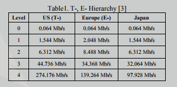
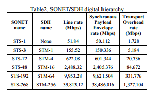

Technologie sieci transportu informacji
#######################################

SDH vs PDH

Wstęp
#####

  W dzisiejszym świecie jednym z dominujących trendów w telekomunikacji
  jest przysył danych. Sieci *SDH* Synchronous Digital Hierarchy
  zyskały aprobate na całym świecie przez swoją elastyczność i znormalizowane
  połączenia między różymi sprzedawcami, niski koszt operacji i bardzo dobrą jakość
  przesyłu informacji.

  Z drugiej strony technologia PDH - Plesiochronus Digital Hierarchy była uzywana
  wcześniej niż standard SDH, i również oferował takie usługi jak cyfrowy i
  radiowy transport dużych paczek danych przez swiatlowody i
  mikrofale(fale pomiedzy podczerwienią 1mm a falami ultrakrótkimi do 30 cm ).
  W tej prezentacji spróbuje przedstawić w czym SDH jest lepsze od PDH i na odwrót.

  PDH została przedstawiona przez *ITU-T* ( International Telecommunication Union,
  zajmuje sie tworzenie standardów objemujących wszystkie dziedziny telekomunikacji)
  by uporać się z rosnącym zapotrzebowaniem
  na wyższy bit rate(szybkosc transmisji danych).
  Podstawowa multipleksacja wynosi 2Mbps, wraz z innymi stadiami 8, 34 i 140 Mbps.

  Przez zróżnicowane rozwiązania roziwjane przez rózne sieci, łączenie gateways pomiedzy
  sieciami stało się drogie i czasochłonne, *PDH* nie byl elastyczny co utrudniało
  monitorowanie i zarządzanie ruchem w sieci.

  *SDH* powstał by poprawić ograniczenia które były w *PDH*. Im więcej ludzi zaczeło
  używać *SDH* tym bardziej rosły jej możliwości (zarządzania siecią i monitoring).

PDH - Plesiochronus Digital Hierarchy
=====================================

  Plezjochroniczna -> plesio - prawie, chrono czas,
  oznacza to że elementy sieci *PDH* są ze sobą zsynchronizowane,
  ale nie idealnie, gdyż każdy z elementów sieci posiada swój zegar.

  *PDH* używa *TDM* (time division multiplexing,
  multipleksacja -> realizacja dwóch lub większej liczby kanałów w
  jednym medium transmisyjnym, TDM -> sygnały są dzielone na częsci którym są
  przypoisawane szczeliny czasowe, w pierwszej szczelinie sa wysylane piersze częsci
  sygnalów w kolejne, kolejne itp).

  Wspiera:
    - cyfrowe kanały głosowe w szybkoscia transmisji 64kbps,
    - no store and forward (chyba cut-throught, przesyla ramkę dalej zanim dostanie
      ja w calosci , zmiejsza to opóźnienie) method.

  Różne standary używane w PDH sprawiają trudności w podłączeniu różnych sieci
  (np w US, Japoni, Europie).

Multipleksacja w PDH
--------------------
  By przeniesc 2Mbps danych z jednego punktu do drugiego, te strumienie danych są
  multipleksowane w grupy bitow, który zawiera po jednym bicie z kazdego strumienia.
  Jest tez dodawany dodatkowy bit (but stuffing) który pozwala zdekodować z którego
  struminia dany byt pochodzi.

Synchonizacja w PDH
-------------------
  W PDH każde urządzenie ma swój zegar, przez co synchronizacja sieci jest niemożliwa.
  Występuje też bardzo dużo błędów spowodowanych usuwaniem i doddawaniem
  tego dodatkowego bitu.

  Z pomocą przychodzi *FAW* (Frame Alignment Word -> grupa bitow w kazdej framce zawsze
  na tych samych pozycjach używane do wyrównania ramek).
  In PDH ze względu na różnice ramek w warstwie transportowej i łącza danych multiplexacja
  i demultiplexacja jest bardzo trudna.

Ograniczenia PDH
----------------

  - nie jest elastyczne, podłaczenie do innych sieci jest bardzo kosztowne i trudne
  - brak możlowości monitorowania performensu, przez co cięzko zoptymalizować sieć
  - brak standardów , PDH ma rózne hierarchie multipleksowania, i cieżko
    zintegrować wszystkie sieci
  - PDH nie pasuje idealnie do połączeń o dużych przepustowościach
  - kiedy przychodzi strumien o niższej przepustowości , cały system musi
    ulec demultipleksacji
  - maksymalna pojemność wynosi 566Mps
  - PDH pozwala tylko na konfiguracje poin-2-point

A więc:
  wraz ze wzrostem zapotrzebowania na wysyłąnie coraz większej ilości danych coraz szybciej
  trzeba było wymyślić coś nowego, bo jak widzieliśmy wcześniej PDH jest ograniczone pod
  względem.

  Hierarchia w PDH

SDH - Synchronous Digital Hierarchy
===================================
  W przeciwnieństwie do PDH, SDH jest oparte na powtarzającej się hierarchii ramek
  o stałej długości
  .. które zostały zaprojektowane do prznoszenia izochronicznych (stały okres  drgań, nie zależnie od zmiany amplitudy)
  Eliminuje bardzo duzo zbędnęj multipleksacji, przez dopuszczenie
  multipleksaccji i demultipleksacji jednego stanu, co zredukowało złożoność problemu
  po stonie hardware'u.

  SONET - synchroniczna siec optyczna, standart strasmisji optycznej uzywający laserów
  lub diod LED

  Najbardziej popularne szybkosci dla SONET/SDH

W skład SDH wchodzi:
====================

- Synchronous mutiplexer
- Synchronous Digital Cross Connect
    to taki switch który potrafi wybrać jedną lub więcej kanałów o niższym stopniu
    i nie potrzebuje do tego kanału transmisyjnego
- Regenerators -> regeneruje sygnał, najważniejszym zadaniem regeneratora jest
  transferowanie danych na odległości większe niż 50 km , sygnał optyczny jest generowany

Struktura ramki
===============
  Struktura ramki jest oparta na synchronicznej bitowej multipleksacji kilku bloków.
  Podstawową ramką transmisyjną jest STM-1 (Synchronous Transport Module).
  Ramka trwa 125 micro sec, i jest to róznoznaczne z 0.125kHz.

Zalety SDH
==========
  W porównaniu do PDH, SDH szybkość transferu może być nawet do 10Gbps.
  Systemy SDH automatycznie się backup'ują, i naprawiają, a błąd jednego elementu sieciowego
  nie wpływa na całą sieć.
  Uproszczone multipleksowanie i demultipleksowanie.
  Wspiera sieci wielopunktowe.
  Umożliwia transportowanie istniejących sygnałów PDH.
  Umożliwia transportowanie kilka wiadomości na raz.

`Opracowanie z którego korzystałem`_

.. _Opracowanie z którego korzystałem: https://pdfs.semanticscholar.org/87b8/20aa3257b8411859c6af09c0df57fb02a4ba.pdf
